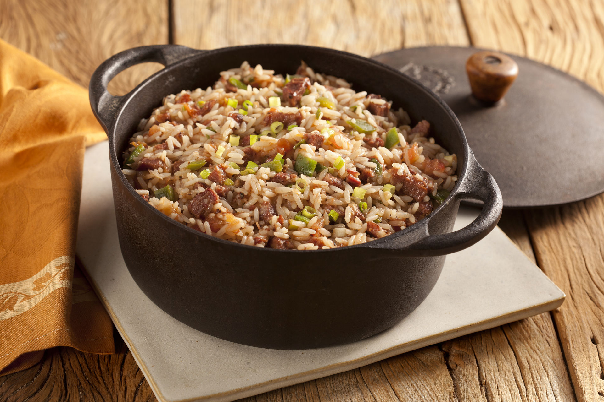

# [Livro de Receitas](../README.md)

## Arroz Carreteiro

### Ingredientes:

- 1 xícara (chá) de sobras de carnes do churrasco picadas em cubos de 1 cm
- 1 xícara (chá) de arroz
- ½ cebola
- 2 dentes de alho
- 1 tomate
- 2 colheres (sopa) de azeite
- 1 folha de louro
- 5 ramos de salsinha
- 3 talos de cebolinha
- ½ colher (chá) de sal
- pimenta-do-reino moída na hora a gosto
- folhas de salsinha a gosto para servir

## Modo de preparo:

- Corte as carnes em cubos de 1 cm – caso o corte escolhido tenha uma camada grossa de gordura, descarte. Nessa receita, usamos picanha e linguiça, mas você pode fazer diferentes combinações com o que tiver sobrado o churrasco.
- Descasque e pique fino a cebola e os dentes de alho. Lave, seque e corte os tomates em quartos; descarte as sementes e corte cada quarto em tiras e as tiras em cubos de 1 cm. Lave, seque e pique fino a salsinha e a cebolinha.
- Numa chaleira, leve um pouco mais de 2 xícaras (chá) de água ao fogo baixo para ferver.
- Leve uma panela média ao fogo médio para aquecer. Regue com 1 colher (sopa) de azeite, acrescente a cebola, tempere com uma pitada de sal e refogue por 4 minutos, até começar a dourar.
- Adicione o tomate, tempere com uma pitada de sal e refogue por 2 minutos até murchar levemente – não é preciso desmanchar. Junte as carnes picadas, o alho e o louro, tempere com pimenta a gosto e mexa por 2 minutos para as carnes aquecerem e absorverem o sabor do refogado.
- Regue com 1 colher (sopa) de azeite, adicione o arroz e mexa bem para envolver todos os grãos com o azeite por 1 minuto – isso ajuda a deixar o arroz soltinho depois de cozido.
- Meça 2 xícaras (chá) da água fervente e regue o arroz. Tempere com ½ colher (chá) de sal, misture bem e não mexa mais. Enquanto isso, prepare a farofa.
- Assim que a água atingir o mesmo nível do arroz, abaixe o fogo e tampe parcialmente a panela. Deixe cozinhar até que o arroz absorva toda a água – para verificar se a água secou, fure o arroz com um garfo e afaste delicadamente alguns grãos do fundo da panela; se ainda estiver molhado, deixe cozinhar mais um pouquinho.
- Desligue o fogo e mantenha a panela tampada por 5 minutos antes de servir para que os grãos terminem de cozinhar no próprio vapor. Em seguida, solte os grãos com um garfo e misture a salsa e cebolinha picadas. Sirva a seguir com molho vinagrete, a farofa tostada e folhas de salsinha.

## Resultado:

