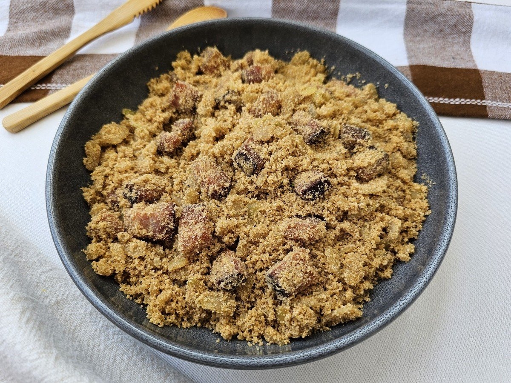

# [Livro de Receitas](../README.md)

## Farofa Tostada

### Ingredientes:

- 1 xícara (chá) de farinha de mandioca torrada
- 25 g de manteiga
- 1 pimenta dedo-de-moça
- sal a gosto

## Modo de preparo:

- Lave, seque e corte a pimenta dedo-de-moça ao meio no sentido do comprimento, descarte as sementes e fatie fino cada metade. Dica: para evitar acidentes com dedos apimentados nos olhos, passe óleo ou azeite nas mãos depois de cortar as pimentas — a capsaicina, substância responsável pelo ardor, é lipossolúvel. Depois, lave as mãos com sabonete para tirar o óleo.
- Leve uma frigideira média com a manteiga ao fogo médio. Assim que derreter, junte a pimenta picada e mexa por 1 minuto para perfumar. Tempere com sal e acrescente a farinha aos poucos, misturando com a espátula. Mexa por mais 5 minutos, até a farofa ficar bem dourada e crocante.

## Resultado:

