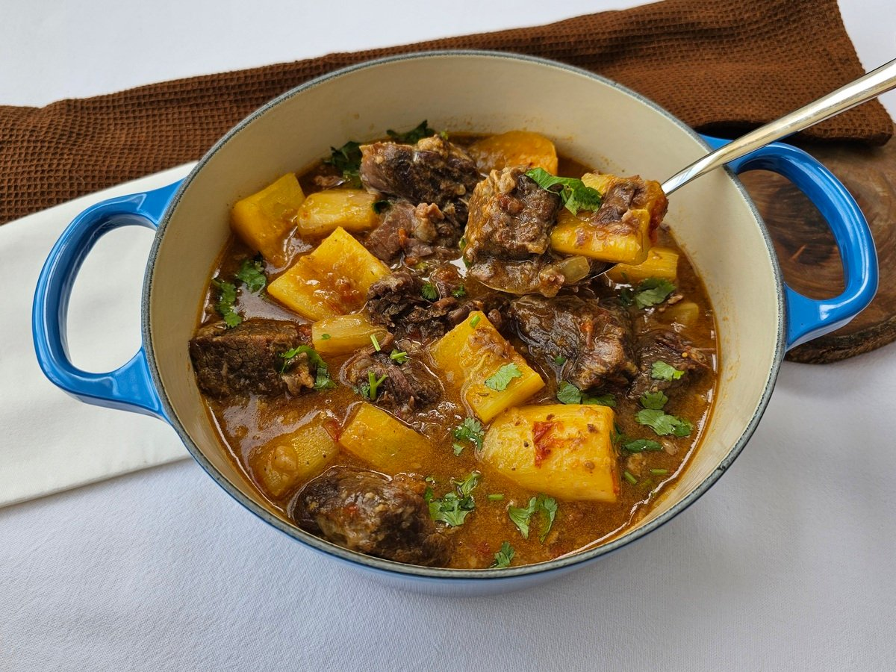

# [Livro de Receitas](../README.md)

## Vaca Atolada

### Ingredientes:

- 1,5 kg de costela bovina
- ¼ de xícara (chá) de farinha de trigo
- 2 cebolas picadas fino
- 2 dentes de alho descascados e amassados
- 2 tomates descascados e sem sementes, picados
- 1 colher (sopa) de vinagre
- 1 litro de água
- 2 colheres (sopa) de óleo
- 3 mandiocas descascadas e cortadas em rodelas de cerca de 2 cm
folhas de salsinha fresca

## Modo de preparo:

- Numa tigela, tempere as costelas com sal e pimenta-do-reino. Salpique a farinha de trigo e misture.
- Leve uma panela de pressão com o óleo ao ao fogo médio. Quando aquecer, frite as costelas, em etapas, até dourarem por todos os lados. Não amontoe as costelas no fundo da panela, para que não criem água (o que vai impedi-las de adquirir o dourado). Retire da panela e transfira para um prato.
- Refogue a cebola na mesma panela. Regue com ¼ de xícara (chá) de água e raspe bem o fundo da panela (esse fundinho é que dá o sabor à receita). Junte os tomates, os dentes de alho, o vinagre e cozinhe por 5 minutos. Retorne as costelas à panela e regue com o litro de água. Tampe a panela, e após começar a apitar, conte 35 minutos.
- Desligue o fogo e, quando toda a pressão sair, abra a panela. Se quiser acelerar, coloque a panela sob água corrente fria (ou levante a válvula com um garfo, mas saiba que isso costuma encurtar a vida útil da panela de pressão).
- Adicione a mandioca e complete com 1 xícara (chá) de água . Deixe cozinhar por 20 minutos, mexendo de vez em quando para o fundo não queimar. Na hora de servir, salpique folhas de salsinha fresca.

## Resultado:

